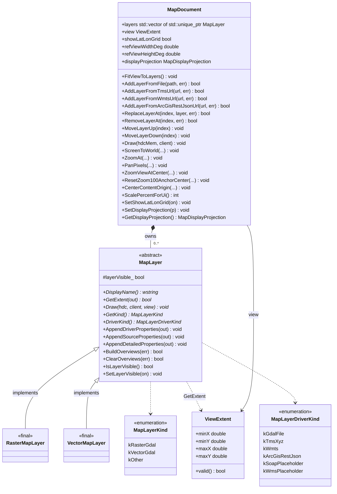
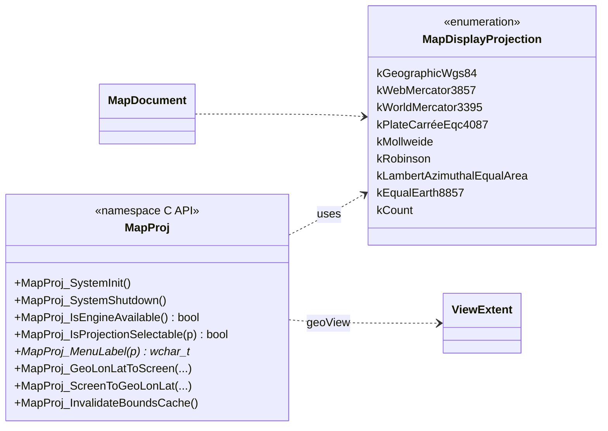
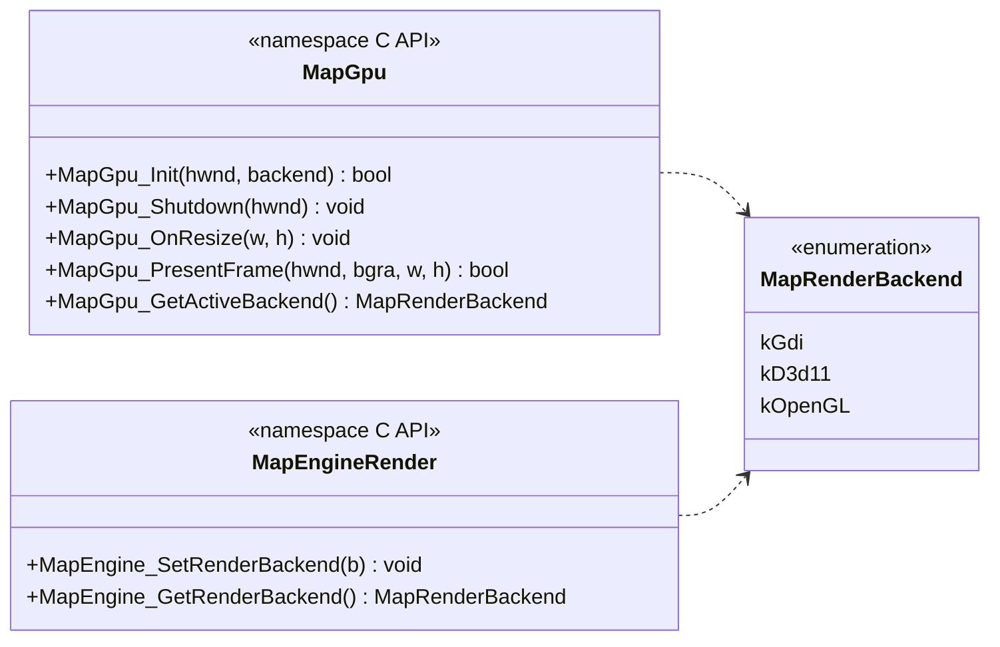

# map 模块 UML 类图（物理阶段）

**源码根**：[`gis-desktop-win32/src/map/`](../../../gis-desktop-win32/src/map/)（`map_engine.*`、`map_gpu.*`、`map_projection.*`）。

**说明**：`MapLayer` 的 GDAL 具体实现类仅在 [`map_engine.cpp`](../../../gis-desktop-win32/src/map/map_engine.cpp) 的 `agis_detail` 命名空间中定义，未暴露在公开头文件中；物理层类图仍列出二者以便与 `std::unique_ptr<MapLayer>` 所有权关系对齐。

---

## 核心类型与继承（map_engine.h + 实现类）

---

## 投影与空白地图（map_projection.h）

`MapDocument` 持有 `MapDisplayProjection`，无图层时与 `MapProj_*` 配合做经纬网/拾取变换；有图层时仍以数据坐标为准（见头文件注释）。

---

## 呈现后端（map_gpu.h）

地图客户区可在 GDI 与 GPU 呈现之间切换；`MapEngine_SetRenderBackend` / `MapEngine_GetRenderBackend` 与 `MapGpu_*` 协同（实现见 `map_gpu.cpp`，含匿名命名空间内 D3D11 / OpenGL 状态，此处不展开为类）。

---

## 引擎门面 API（map_engine.h，节选）

以下为**非成员函数**集合，供 Win32 窗口过程与 UI 调用；与 `MapDocument` 单例及全局 GDAL 生命周期配合。

| 分组 | 代表符号 |
|------|----------|
| 生命周期 | `MapEngine_Init`, `MapEngine_Shutdown`, `MapEngine_Document` |
| 宿主窗口 | `MapHostProc`, `MapEngine_UpdateMapChrome` |
| 图层列表 UI | `MapEngine_RefreshLayerList`, `MapEngine_MeasureLayerListItem`, `MapEngine_PaintLayerListItem`, `MapEngine_OnLayerListClick` |
| 图层与属性 | `MapEngine_GetLayerCount`, `MapEngine_OnAddLayerFromDialog`, `MapEngine_GetLayerInfoForUi`, `MapEngine_IsRasterGdalLayer`, `MapEngine_BuildOverviewsForLayer`, `MapEngine_ClearOverviewsForLayer`, `MapEngine_ReplaceLayerSourceFromUi`, `MapEngine_ShowLayerDriverDialog` |
| 截图 | `MapEngine_SaveMapScreenshotToFile`, `MapEngine_PromptSaveMapScreenshot` |

---

## 与 mapping 交叉引用

实现符号 → 源码路径见 [mapping.md](mapping.md) 中 `src/map/` 相关行；本图侧重 **类型关系与模块边界**，字段级行为以 [spec.md](spec.md) 为准。
