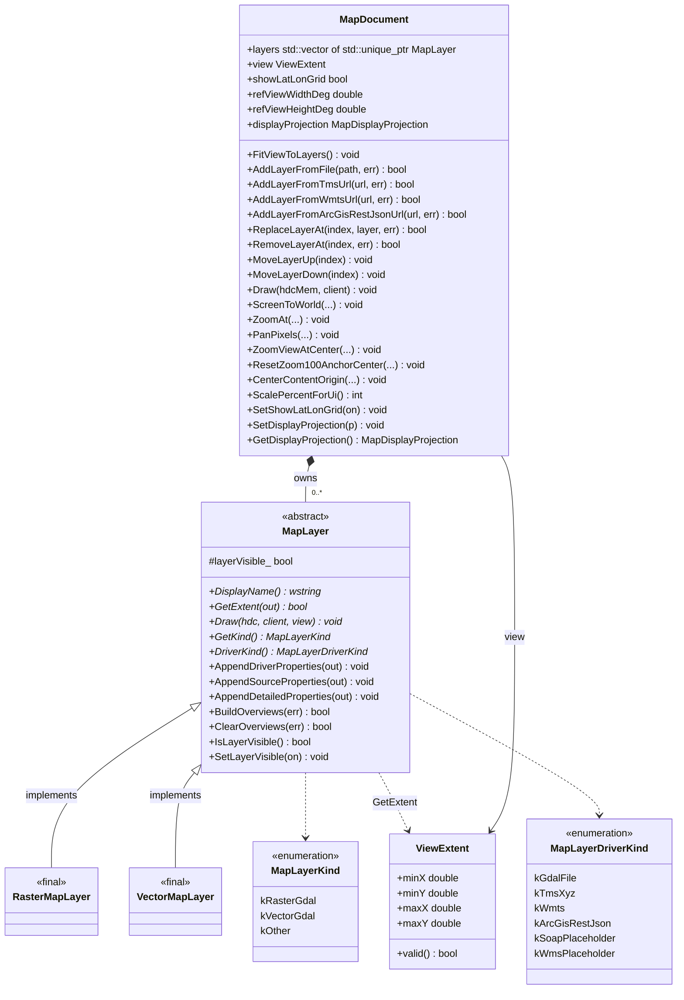
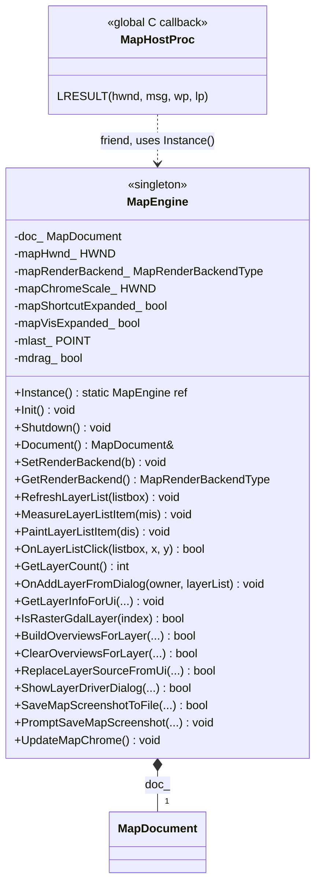
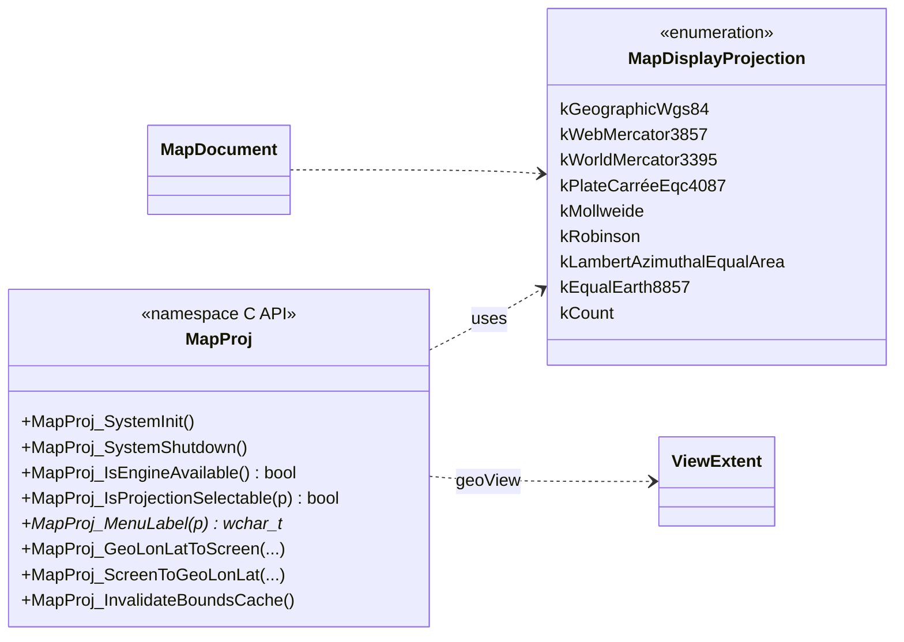
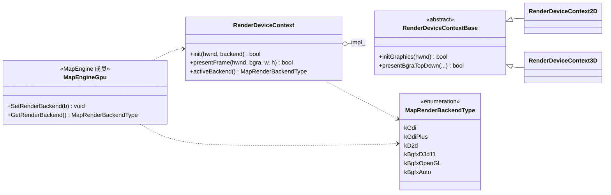

# map 模块 UML 类图（物理阶段）

**源码根**：[`map_engine/`](../../../map_engine/)（每组 `map_engine/<组>/include/map_engine/*.h` + `map_engine/<组>/src/*.cpp`）。

**说明**：`MapLayer` 的 GDAL 具体实现类仅在 [`map_engine.cpp`](../../../map_engine/engine/src/map_engine.cpp) 的 `agis_detail` 命名空间中定义，未暴露在公开头文件中；物理层类图仍列出二者以便与 `std::unique_ptr<MapLayer>` 所有权关系对齐。

---

## 核心类型与继承（map_layer.h / map_document.h + map_engine.cpp 实现类）

---

## 地图引擎单例（map_engine.h）

应用内通过 **`MapEngine::Instance()`** 访问唯一引擎实例；**`MapDocument doc_`** 为引擎私有成员，对外经 **`Document()` / `Document() const`** 暴露。地图子窗口过程 **`MapHostProc`** 声明为 **`friend`**，可直接访问引擎内部状态（如 `doc_`、`mapHwnd_`、中键平移状态等）。GDAL 图层工厂仍见 `map_engine_internal.h` / `agis_detail`（`map_engine.cpp`）。

---

## 投影与空白地图（map_projection.h）

`MapDocument` 持有 `MapDisplayProjection`，无图层时与 `MapProj_*` 配合做经纬网/拾取变换；有图层时仍以数据坐标为准（见头文件注释）。**非地理投影**（依赖 PROJ 时）下，将当前视口经纬范围对应的**投影平面外包框**映射到客户区像素时采用**统一比例尺并居中**（视口长宽比与外包框不一致时两侧或上下留边），避免 X/Y 非等比拉伸；`MapProj_ScreenToGeoLonLat` 与正向变换使用同一套偏移与比例。

---

## 呈现后端（render_device_context.h）

地图客户区可在 GDI / GDI+ / Direct2D 与 bgfx（D3D11 / OpenGL / Auto）之间切换；**`MapEngine::SetRenderBackend` / `MapEngine::GetRenderBackend`**（经 **`Instance()`**）驱动 **`RenderDeviceContext`**（宿主聚合，实现见 `platform/src/render_device_context.cpp` 与 `platform/src/render_device_context/render_device_context_d2d.cpp` / `render_device_context_bgfx.cpp`）。

---

## MapEngine 成员与 UI 对应（节选）

宿主与主窗口通过 **`MapEngine::Instance().…`** 调用（例如 `main.cpp`）。**`Init` / `Shutdown`** 内配合 **`MapProj_SystemInit` / `MapProj_SystemShutdown`** 与（若启用 GDAL）**`GDALAllRegister`**。

| 分组 | 成员函数（经 `Instance()`） |
|------|-----------------------------|
| 生命周期 | `Init`, `Shutdown`, `Document` |
| 宿主与叠层 | `UpdateMapChrome`；`MapHostProc`（全局 C 回调，非成员） |
| 图层列表 UI | `RefreshLayerList`, `MeasureLayerListItem`, `PaintLayerListItem`, `OnLayerListClick` |
| 图层与属性 | `GetLayerCount`, `OnAddLayerFromDialog`, `GetLayerInfoForUi`, `IsRasterGdalLayer`, `BuildOverviewsForLayer`, `ClearOverviewsForLayer`, `ReplaceLayerSourceFromUi`, `ShowLayerDriverDialog` |
| 截图 | `SaveMapScreenshotToFile`, `PromptSaveMapScreenshot` |

---

## 与 mapping 交叉引用

实现符号 → 源码路径见 [mapping.md](mapping.md) 中 `map_engine/` 相关行；本图侧重 **类型关系与模块边界**，字段级行为以 [spec.md](spec.md) 为准。
