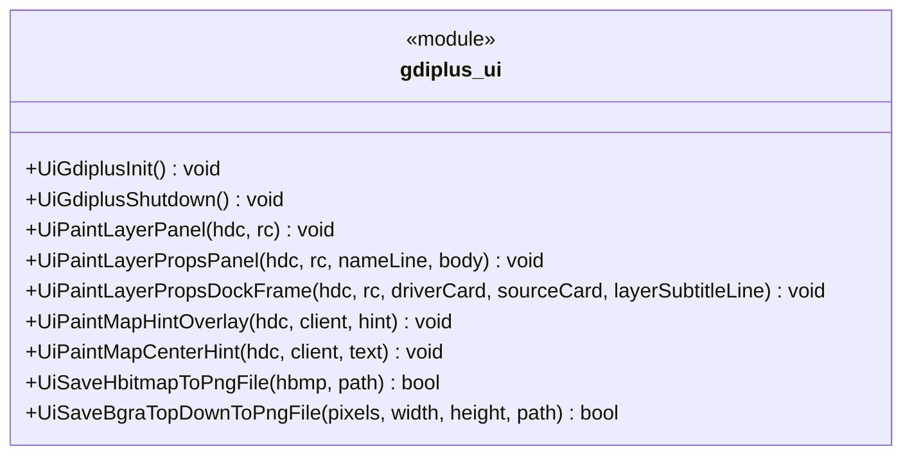

# ui 模块 UML 类图（物理阶段）

**源码根**：[`gis-desktop-win32/src/ui/`](../../../gis-desktop-win32/src/ui/)（当前仅 [`gdiplus_ui.h`](../../../gis-desktop-win32/src/ui/gdiplus_ui.h) / [`gdiplus_ui.cpp`](../../../gis-desktop-win32/src/ui/gdiplus_ui.cpp)）。

**说明**：本模块**未定义 C++ 类**，对外为全局函数 API（GDI+ 绘制与 PNG 导出）。类图用 **`«module»`** 表示编译单元公开接口；[`gdiplus_ui.cpp`](../../../gis-desktop-win32/src/ui/gdiplus_ui.cpp) 内匿名命名空间另有辅助函数（圆角路径、属性区卡片、PNG 编码器 CLSID 查询等），不暴露在头文件中。

---

## 公开 API（gdiplus_ui.h）

### 职责简述

| 符号 | 职责 |
|------|------|
| `UiGdiplusInit` / `UiGdiplusShutdown` | `GdiplusStartup` / `GdiplusShutdown` 与进程内 token（`.cpp` 文件作用域静态变量）。 |
| `UiPaintLayerPanel` | 左侧「图层」Dock 顶区：渐变背景、标题「图层」、副标题与「左」角标。 |
| `UiPaintLayerPropsPanel` | 右侧「图层属性」整卡：顶区 + 单卡片内 `nameLine` / `body` 文本（GDI+）。 |
| `UiPaintLayerPropsDockFrame` | 右侧 Dock **仅装饰**：双卡片区轮廓（驱动属性 / 数据源属性）或单卡回退；详细多行文本由宿主 `EDIT` 子控件承载。 |
| `UiPaintMapHintOverlay` | 地图客户区**右下**半透明提示条（在 GDI `BitBlt` 之后叠加）。 |
| `UiPaintMapCenterHint` | 地图客户区**中央**圆角卡片提示（如无 GDAL 等）。 |
| `UiSaveHbitmapToPngFile` | `HBITMAP` → PNG 文件（GDI+ `Bitmap` + PNG 编码器）。 |
| `UiSaveBgraTopDownToPngFile` | 顶行在前的 BGRA8 像素缓冲 → PNG（与 `CreateDIBSection` 32 位自上而下一致）。 |

---

## 依赖（实现侧，非本仓库类型）

- **GDI+**：`#include <gdiplus.h>`，链接 `gdiplus.lib`（见 `gdiplus_ui.cpp` `#pragma comment`）。
- **调用方**：主窗口与地图宿主在 [`main.cpp`](../../../gis-desktop-win32/src/app/main.cpp)、[`map_engine.cpp`](../../../gis-desktop-win32/src/map/map_engine.cpp) 等处按区域 `RECT` 调用上述绘制函数。

---

## 实现文件内私有符号（匿名命名空间，摘要）

仅用于文档追溯，**不**作为对外契约：

| 符号 | 作用 |
|------|------|
| `g_gdiplusToken` | `ULONG_PTR`，GDI+ 启动 token。 |
| `FillRoundRectPath` | 构建圆角矩形 `GraphicsPath`。 |
| `PaintPropsSectionCard` | 填充/描边单张属性区卡片。 |
| `DrawPropsCardHeader` | 卡片顶区：左侧强调条 + 主副标题。 |
| `GetPngEncoderClsid` | 枚举编码器，查找 `image/png` 的 CLSID。 |
