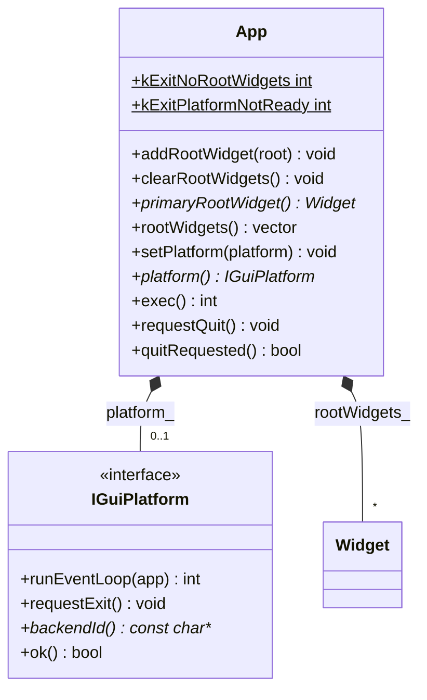
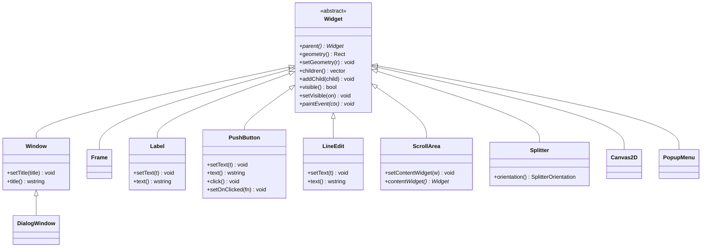
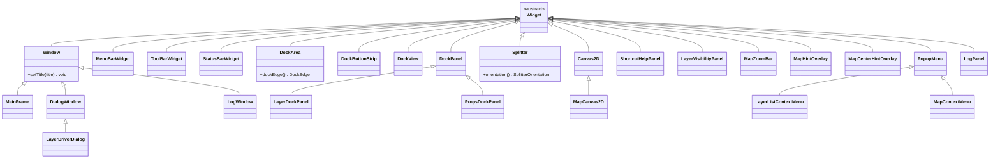
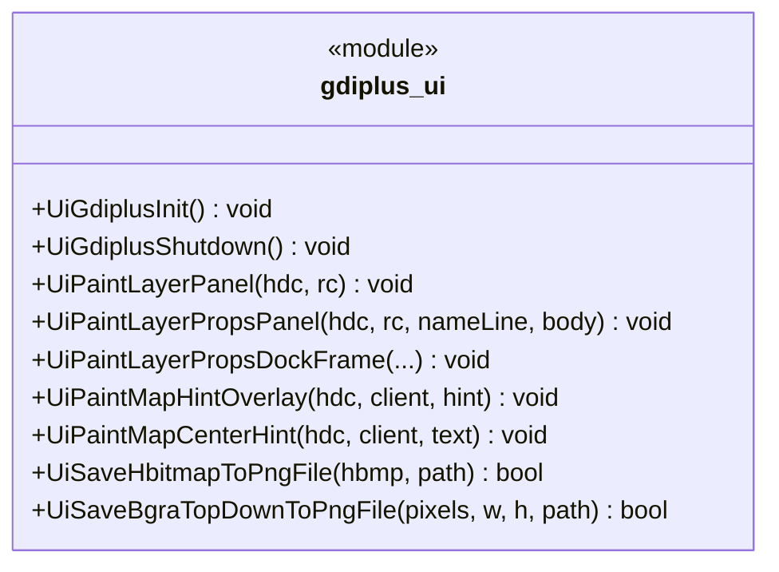

# ui 模块 UML 类图（物理阶段）

**源码根**：[`ui_engine/`](../../../ui_engine/)（按模块 `core` / `widgets` / `gdiplus` / `platform` / `demo` 分 `include`+`src`；公开 API 仍为 `#include "ui_engine/..."`，见 [`ui_engine/README.md`](../../../ui_engine/README.md)）

**定位**：**`agis::ui`** 为与 Qt 类似的**抽象本地 GUI 模型**（`App` + `Widget` 树 + 若干控件子类）；**绘制与事件循环**通过 **`IGuiPlatform`** 按操作系统切换后端（Win32、Linux XCB/Xlib、macOS Cocoa 等）。**`App` 为进程内单例**（`App::instance()`），可 **`addRootWidget` 注册多棵顶层根 Widget**；`setPlatform` / `exec()` 均作用于同一实例。**`exec()`** 若**尚未注册任何根 Widget**则返回 **`kExitNoRootWidgets`（错误退出）**；否则内部调用各平台 `runEventLoop`，即**操作系统消息循环封装在 `IGuiPlatform` 实现中**。未设置平台时 `exec` 在通过根 Widget 校验后使用 `null` 后端；`IGuiPlatform::ok()` 可由平台覆盖（如 Win32 演示窗体创建失败）。与现有 [`gdiplus_ui.h`](../../../ui_engine/gdiplus/include/ui_engine/gdiplus_ui.h) 全局绘制 API **并存**，主程序也可仍由 Win32 消息泵自管。

---

## 进程入口参数（app_launch_params.h）

- **`AppLaunchParams`**：`argc` / `argv`、`native_app_instance`（`void*`，Win32 下语义为 `HINSTANCE`）、`show_window_command`（Win32 下为 `nShowCmd`）。**公共头不引入系统头**，由各平台入口 TU（如含 `<windows.h>` 的 `wWinMain`）填入后交给 `PlatformWindows(launch)` 等。
- **`make_launch_params(...)`**：便捷填充。

---

## 跨平台后端（platform_gui.h）

| `backendId()` 典型返回值 | 说明 |
|--------------------------|------|
| `"win32"` | Win32 USER32 / GDI / GDI+ / 可选 Direct2D |
| `"xcb"` / `"xlib"` | Linux X11 客户端 |
| `"cocoa"` | macOS AppKit |
| `"null"` | 空实现（设计/单测占位） |

**具体实现（`IGuiPlatform`）**：

| 文件 | 平台 | 说明 |
|------|------|------|
| [`platform_windows.h`](../../../ui_engine/platform/include/platform/platform_windows.h) / [`platform_windows.cpp`](../../../ui_engine/platform/src/platform_windows.cpp) | Windows | `GetMessage` / `DispatchMessage`；演示壳 `PlatformWindows(AppLaunchParams)` |
| [`platform_xlib.h`](../../../ui_engine/platform/src/platform_xlib.h) / [`platform_xlib.cpp`](../../../ui_engine/platform/src/platform_xlib.cpp) | Linux（默认） | Xlib `Display*`，轮询 `XPending`（占位，需窗口后补全） |
| [`platform_xcb.h`](../../../ui_engine/platform/src/platform_xcb.h) / [`platform_xcb.cpp`](../../../ui_engine/platform/src/platform_xcb.cpp) | Linux（`-DAGIS_UI_USE_XCB=ON`） | `xcb_poll_for_event` 轮询 |
| [`platform_cocoa.h`](../../../ui_engine/platform/src/platform_cocoa.h) / [`platform_cocoa.mm`](../../../ui_engine/platform/src/platform_cocoa.mm) | macOS | `NSApplication` 主循环 |
| [`platform_gui.h`](../../../ui_engine/core/include/ui_engine/platform_gui.h) `CreateGuiPlatform` | [`platform_factory.cpp`](../../../ui_engine/platform/src/platform_factory.cpp) | 全平台 | 编译期写死分支，创建当前目标对应的 `IGuiPlatform`；应用与演示入口只包含 `platform_gui.h`，无需直接包含各 `platform_*.h` |

CMake 按 `WIN32` / `APPLE` / `UNIX` 编译当前平台对应 `platform_*.cpp/.mm` 并链接；[`platform_factory.cpp`](../../../ui_engine/platform/src/platform_factory.cpp) 始终参与 `agis_ui_engine`（Linux X11 需 `FindX11`，XCB 需 `libxcb`）。

---

## 几何与绘制（ui_types.h）

- **`Point` / `Size` / `Rect`**：整数像素逻辑坐标。
- **`PaintContext`**：`nativeDevice` 为不透明指针（如 `HDC`、`cairo_t*`、`CGContextRef`），由后端填充。

---

## 通用 Widget 继承树（widget.h / widget_core.h）

可复用基元；实现见 [`widgets.cpp`](../../../ui_engine/widgets/src/widgets.cpp)。

**说明**：父子关系仅通过 **`Widget::addChild(std::unique_ptr<Widget>)`**（或 `ScrollArea::setContentWidget` 对内容控件设置 `parent_`）建立；**无信号槽**，交互由后端调用如 **`PushButton::click()`**。

---

## AGIS 主框架壳层 + 主程序私有（widgets_mainframe.h / app/ui_private.h）

与当前 [`main.cpp`](../../../gis-desktop-win32/src/app/workbench/main.cpp) / [`map_engine.cpp`](../../../map_engine/shell/src/map_engine.cpp) / [`resource.h`](../../../common/core/include/core/resource.h) 中的 **HWND / IDC / 菜单 ID** 一一对应的类型（**抽象桩**）。声明在 [`widgets_mainframe.h`](../../../ui_engine/widgets/include/ui_engine/widgets_mainframe.h)（内部已 `#include` [`widget_core.h`](../../../ui_engine/core/include/ui_engine/widget_core.h)）；与主窗口 HWND 强绑定的类型见 [`ui_private.h`](../../../ui_engine/widgets/include/ui_engine/ui_private.h)；实现见 [`widgets_mainframe.cpp`](../../../ui_engine/widgets/src/widgets_mainframe.cpp)。[`widgets_all.h`](../../../ui_engine/widgets/include/ui_engine/widgets_all.h) 一次包含通用 + 主框架 + 私有。

| `agis::ui` 类型 | 实现侧（当前 Win32） |
|-----------------|----------------------|
| `MainFrame` | 主窗口类 `AGISMainFrame`，`g_hwndMain` |
| `MenuBarWidget` | `BuildMenu()` / `SetMenu` 顶层菜单 |
| `ToolBarWidget` | `CreateMainToolbar`，`IDC_MAIN_TOOLBAR` |
| `StatusBarWidget` | 底部 `STATUSCLASSNAME`，`g_hwndStatus` |
| `DockArea` + `DockButtonStrip` + `DockView` | 左/右 Dock 布局带；缘条按钮 `IDC_LAYER_DOCK_STRIP_BTN` / `IDC_PROPS_DOCK_STRIP_BTN` |
| `LayerDockPanel` | `AGISLayerPane`，图层列表 `IDC_LAYER_LIST` |
| `PropsDockPanel` | `AGISPropsPane`，属性 EDIT/按钮 `IDC_PROPS_*` |
| `Splitter` | `kSplitterW` 拖拽调左右 Dock 与地图宽度 |
| `MapCanvas2D` | `AGISMapHost`，`g_hwndMap` |
| `ShortcutHelpPanel` | `IDC_MAP_SHORTCUT_TOGGLE` / `IDC_MAP_SHORTCUT_EDIT` |
| `LayerVisibilityPanel` | `IDC_MAP_VIS_TOGGLE` / `IDC_MAP_VIS_GRID` |
| `MapZoomBar` | `IDC_MAP_SCALE_TEXT`、`IDC_MAP_FIT` / `ORIGIN` / `RESET`、缩放 ± |
| `MapHintOverlay` | `UiPaintMapHintOverlay` 右下提示 |
| `MapCenterHintOverlay` | `UiPaintMapCenterHint` 中央提示 |
| `LayerDriverDialog` | `AGISLayerDriverDlg`，`ShowLayerDriverDialog` / `LayerDriverDlgProc` |
| `LogWindow` | `AGISLogWindow`，`ShowLogDialog` |
| `LogPanel` | 日志窗内 `IDC_LOG_EDIT` / `IDC_LOG_COPY` |
| `LayerListContextMenu` | 图层列表 `WM_CONTEXTMENU` → `ID_LAYER_CTX_*` |
| `MapContextMenu` | 地图区右键占位（`WM_CONTEXTMENU` 当前无菜单） |
| `PopupMenu` | 右键弹出基类（`CreatePopupMenu` / `TrackPopupMenu`） |

---

## 过程式 GDI+ API（gdiplus_ui.h）

与 **`agis::ui` 类层次独立**，供当前主窗口自绘 Dock / 地图叠加层等：

---

## 实现文件内私有符号（gdiplus_ui.cpp，摘要）

| 符号 | 作用 |
|------|------|
| `g_gdiplusToken` | GDI+ 启动 token |
| `FillRoundRectPath` | 圆角路径 |
| `PaintPropsSectionCard` / `DrawPropsCardHeader` | 属性区卡片 |
| `GetPngEncoderClsid` | PNG 编码器 CLSID |

---

## 依赖与调用关系

- **GDI+**：见 `gdiplus_ui.cpp`。
- **`agis::ui`**：无强制第三方；后端实现可再链接各平台库。
- **主程序**：[`main.cpp`](../../../gis-desktop-win32/src/app/main.cpp) 仍使用 Win32；未来可将消息泵迁入 `IGuiPlatform` 的 `runEventLoop`（Win32 实现）。
