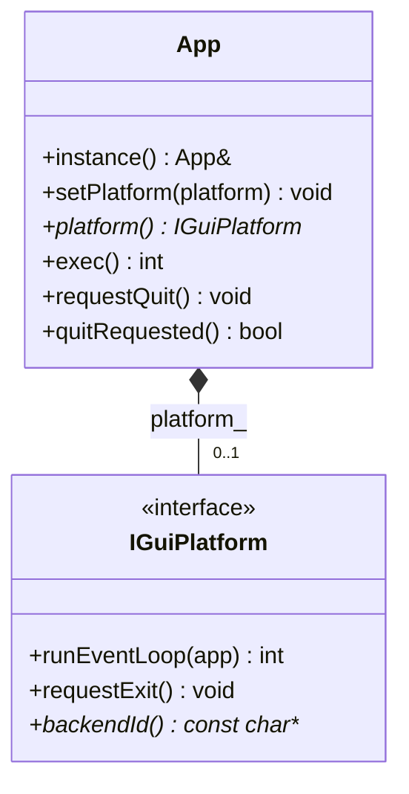
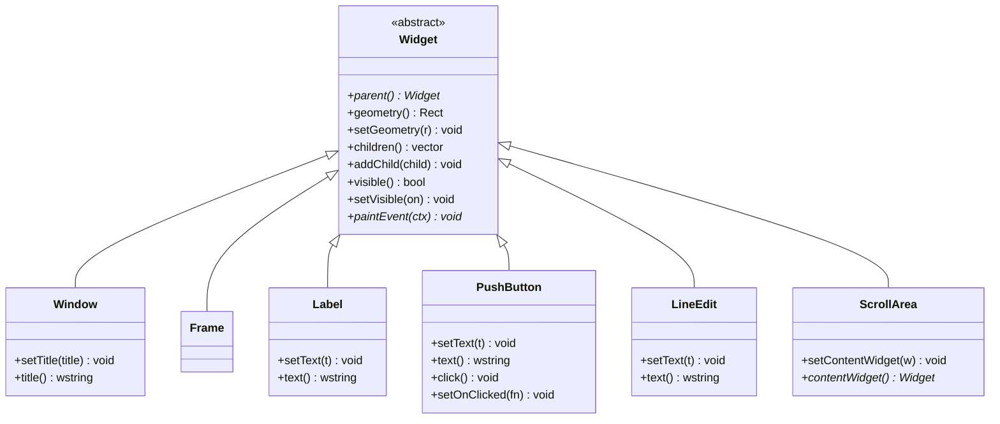
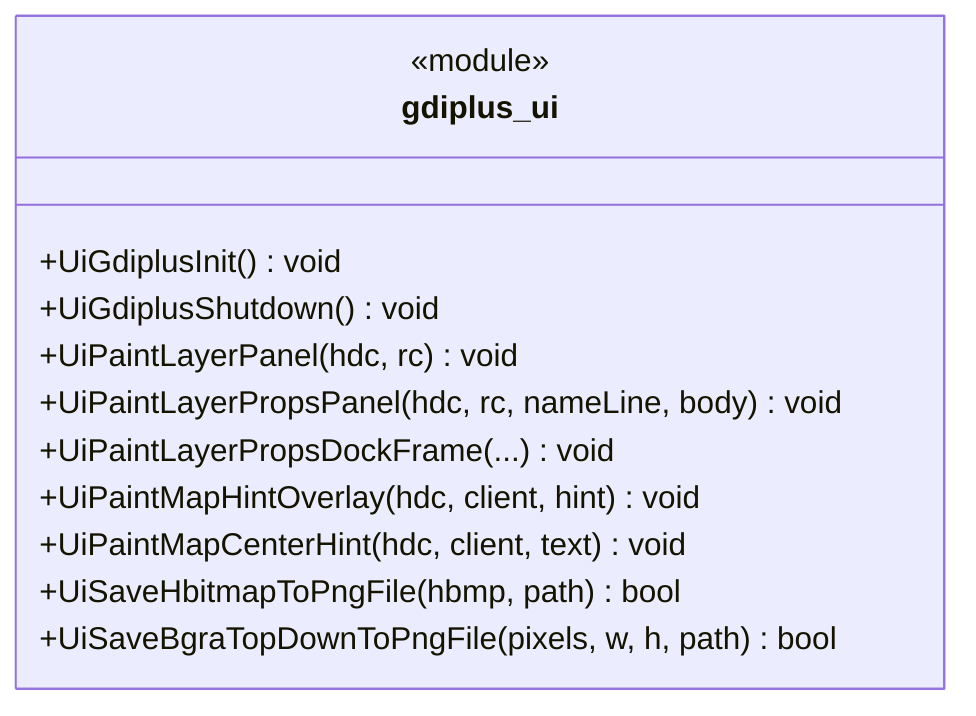

# ui 模块 UML 类图（物理阶段）

**源码根**：[`gis-desktop-win32/src/ui/`](../../../gis-desktop-win32/src/ui/)

**定位**：**`agis::ui`** 为与 Qt 类似的**抽象本地 GUI 模型**（`App` + `Widget` 树 + 若干控件子类）；**绘制与事件循环**通过 **`IGuiPlatform`** 按操作系统切换后端（Win32、Linux XCB/Xlib、macOS Cocoa 等）。当前仓库实现为**可编译桩**（`exec` 默认 `null` 后端立即返回），与现有 [`gdiplus_ui.h`](../../../gis-desktop-win32/src/ui/gdiplus_ui.h) 全局绘制 API **并存**，主程序仍可由 Win32 消息泵驱动。

---

## 跨平台后端（platform_gui.h）

| `backendId()` 典型返回值 | 说明 |
|--------------------------|------|
| `"win32"` | Win32 USER32 / GDI / GDI+ / 可选 Direct2D |
| `"xcb"` / `"xlib"` | Linux X11 客户端 |
| `"cocoa"` | macOS AppKit |
| `"null"` | 空实现（设计/单测占位） |

---

## 几何与绘制（ui_types.h）

- **`Point` / `Size` / `Rect`**：整数像素逻辑坐标。
- **`PaintContext`**：`nativeDevice` 为不透明指针（如 `HDC`、`cairo_t*`、`CGContextRef`），由后端填充。

---

## Widget 继承树（widget.h / widgets.h）

**说明**：父子关系仅通过 **`Widget::addChild(std::unique_ptr<Widget>)`**（或 `ScrollArea::setContentWidget` 对内容控件设置 `parent_`）建立；**无信号槽**，交互由后端调用如 **`PushButton::click()`**。

---

## 过程式 GDI+ API（gdiplus_ui.h）

与 **`agis::ui` 类层次独立**，供当前主窗口自绘 Dock / 地图叠加层等：

---

## 实现文件内私有符号（gdiplus_ui.cpp，摘要）

| 符号 | 作用 |
|------|------|
| `g_gdiplusToken` | GDI+ 启动 token |
| `FillRoundRectPath` | 圆角路径 |
| `PaintPropsSectionCard` / `DrawPropsCardHeader` | 属性区卡片 |
| `GetPngEncoderClsid` | PNG 编码器 CLSID |

---

## 依赖与调用关系

- **GDI+**：见 `gdiplus_ui.cpp`。
- **`agis::ui`**：无强制第三方；后端实现可再链接各平台库。
- **主程序**：[`main.cpp`](../../../gis-desktop-win32/src/app/main.cpp) 仍使用 Win32；未来可将消息泵迁入 `IGuiPlatform` 的 `runEventLoop`（Win32 实现）。
