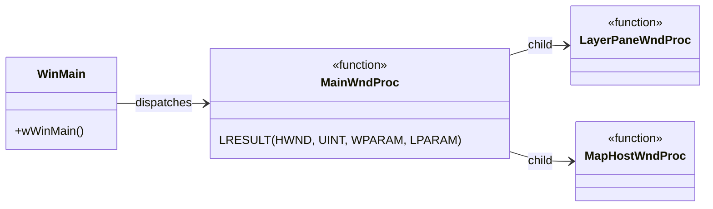

# gis-desktop-win32 UML（首版）

首版以 **过程式 Win32** 为主，类层次极少。Mermaid 类图：

```mermaid
classDiagram
    direction LR
    class WinMain {
      +wWinMain()
    }
    class MainWndProc {
      <<function>>
      LRESULT(HWND, UINT, WPARAM, LPARAM)
    }
    class LayerPaneWndProc {
      <<function>>
    }
    class MapHostWndProc {
      <<function>>
    }
    WinMain --> MainWndProc : dispatches
    MainWndProc --> LayerPaneWndProc : child
    MainWndProc --> MapHostWndProc : child
```

后续引入 `Application`、`MainWindow`、`Project` 等类型后更新本图。
